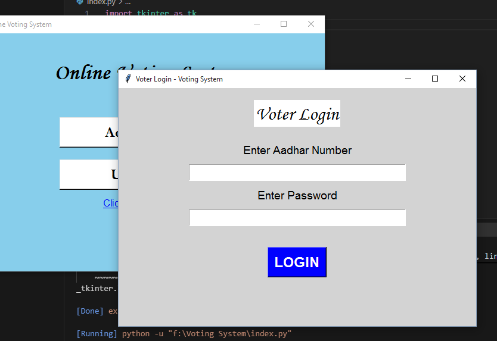
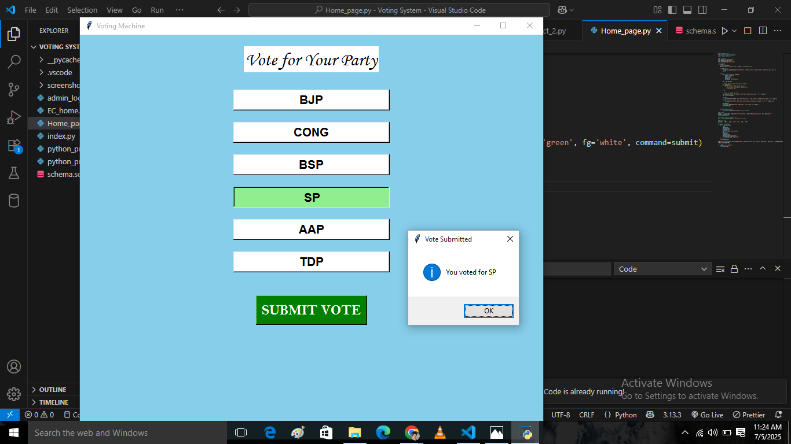
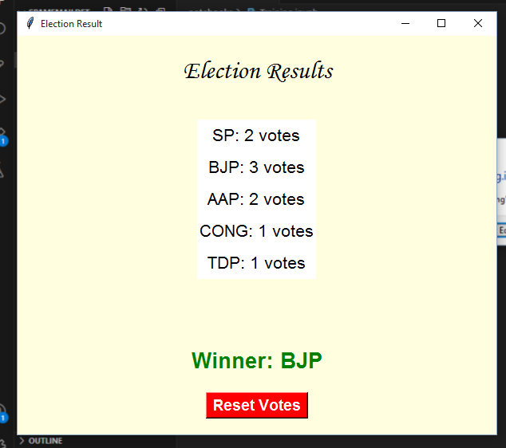

# Online Voting System using Python & MySQL

This project is a GUI-based **Voting System** built with **Python (Tkinter)** and **MySQL**. It allows users to register, login, cast votes, and enables the admin to view voting results.

---

##  Features

- User Registration & Login
- Secure login with Aadhar & Password
- Vote casting interface (one-time vote)
- Admin view to check voting results
- MySQL Database integration

---

##  Project Structure

```
Voting System/
│
|──index.py                          # Home page
|── register.py                      # User Registration Form
│── user_login.py                    # User Login Form
│── voting_page.py                   # Vote Casting Interface
│── result_page.py                   # Admin Vote Result Page
│                
│
├── schema.sql                        # Database schema setup
├── requirements.txt                  # Python dependencies
├── README.md                         # Project documentation
│
├── screenshot/                           # Screenshots/images
│   ├── registration_form.png
│   ├── user_login.png
│   ├── voting_page.png
│   └── admin_results.png
```
Project Structure Diagram
                  ┌────────────────────┐
                  │     Homepage       │
                  │                    │
                  └────────┬───────────┘
                           │
          ┌────────────────┴──────────────┐
          │                               │
   ┌──────▼──────┐                ┌───────▼───────┐
   │   User Flow │                │  Admin Flow   │
   └──────┬──────┘                └───────┬───────┘
          │                                │
 ┌────────▼────────┐              ┌────────▼────────┐
 │  Registration   │              │   Admin Login   │
 │                 │              │                 │
 └────────┬────────┘              └────────┬────────┘
          │                                │
 ┌────────▼────────┐              ┌────────▼────────┐
 │   User Login    │              │   Results View  │
 │                 │              │                 │
 └────────┬────────┘              └──────────────────
          │
 ┌────────▼────────┐
 │   Vote Window   │
 │                 │
 └────────┬────────┘
          │
 ┌────────▼────────┐
 │  votes Table    │
 │                 │
 └─────────────────┘


---
##  Database Schema

### Table: `myuser`

| Column      | Type    | Description            |
|-------------|---------|------------------------|
| aadhar      | DOUBLE  | Unique Aadhar number   |
| name        | TEXT    | User's full name       |
| fathername  | TEXT    | Father's name          |
| age         | INT     | Age                    |
| city        | TEXT    | City                   |
| password    | TEXT    | Login password         |
| pincode     | INT     | Pin code               |
| address     | TEXT    | Address                |
| mobileno    | DOUBLE  | Mobile number          |

### Table: `votes`

| Column      | Type     | Description           |
|-------------|----------|-----------------------|
| party_name  | TEXT     | Political party name  |
| vote_count  | INTEGER  | Number of votes       |

---
##  Screenshots

### User Registration


### User Login


### Voting Page


### Admin Result View


---
## Technologies Used

- Python (Tkinter)
- MySQL (WAMP/XAMPP)
- MySQL Connector

---

##  Setup Instructions

1. Run WAMP/XAMPP and start MySQL service
2. Import `schema.sql` into phpMyAdmin
3. Make sure your database name is `VotingSystem`
4. Run `register.py` to begin user registration
5. Login via `user_login.py` and vote through `voting_page.py`
6. Admin can view results in `result_page.py`

---
##  Requirements

Install dependencies using:

```
pip install -r requirements.txt
```
## 🧪 How to Run

### 🛠️ Prerequisites
- Python 3.x installed
- MySQL (via WAMP/XAMPP server)
-`mysql-connector-python` library

```bash
pip install mysql-connector-python
```
---
## Developed By

- Sujal Gupta

---

## License

This project is for educational purposes only.
